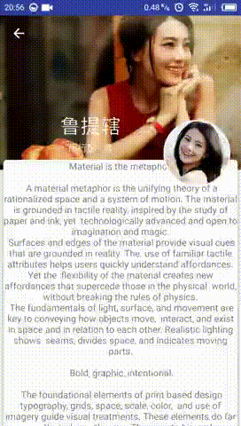

# MaterialDesignSamples

MaterialDesign控件的使用示例，以及个人的一些作品总结，会持续更新

自定义Behavior之Floating头像 [实现思路](http://blog.csdn.net/lj402159806/article/details/55106366)

自定义Behavior之ToolBar上滑TabLayout颜色渐变 [实现思路](http://blog.csdn.net/lj402159806/article/details/55212686)

